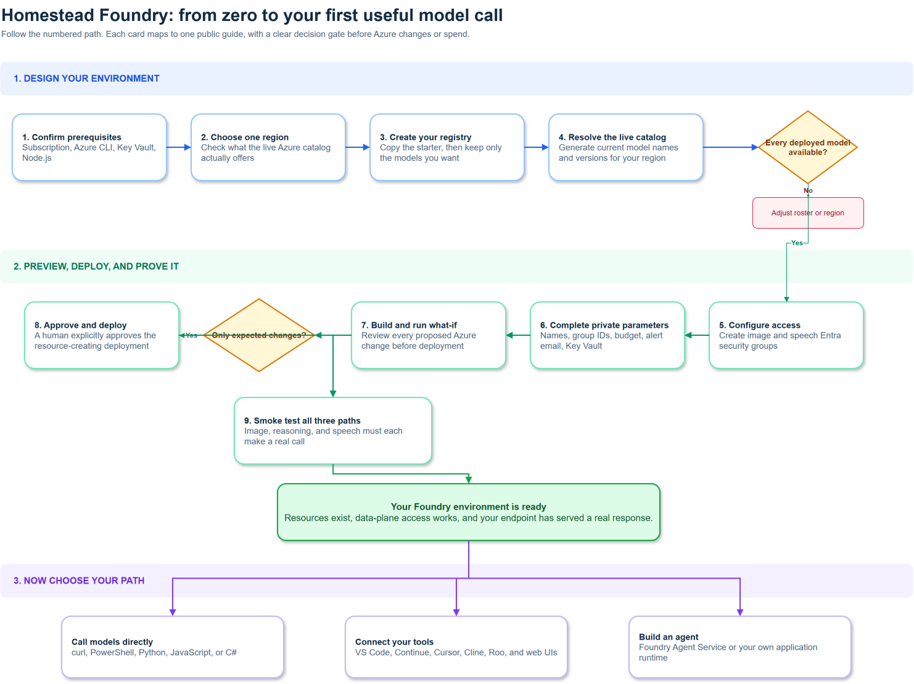

# Getting started

Homestead Foundry (`Hybrid-Solutions-Cloud/homestead-foundry`) documents and automates building on **Azure AI Foundry**. This site is a published mirror of the repository's `ai/` and `models/` content, meant to be read on its own without needing repo access.

## Your route from zero to useful

Use this map as your checklist. Follow the blue path from top to bottom. Once
the smoke test succeeds, choose the branch that matches what you want to do
next. Every box links to the guide or check that explains that step in detail.

<map name="foundry-onboarding-map">
  <area shape="rect" coords="20,184,270,294" href="./deployment#before-you-start" alt="Confirm prerequisites" />
  <area shape="rect" coords="309,184,560,294" href="./deployment#before-you-start" alt="Choose one region" />
  <area shape="rect" coords="599,184,850,294" href="./model-registry" alt="Create your registry" />
  <area shape="rect" coords="890,184,1140,294" href="./deployment#3-generate-the-model-catalog" alt="Resolve the live catalog" />
  <area shape="rect" coords="1150,490,1400,600" href="./deployment#2-create-the-two-security-groups" alt="Configure access" />
  <area shape="rect" coords="860,490,1110,600" href="./deployment#4-fill-in-your-parameters" alt="Complete private parameters" />
  <area shape="rect" coords="570,490,820,600" href="./deployment#5-preview-then-deploy" alt="Build and run what-if" />
  <area shape="rect" coords="40,490,290,600" href="./deployment#5-preview-then-deploy" alt="Approve and deploy" />
  <area shape="rect" coords="380,645,700,755" href="./deployment#6-verify" alt="Smoke test all three paths" />
  <area shape="rect" coords="100,1000,460,1109" href="./using-your-deployment" alt="Call models directly" />
  <area shape="rect" coords="560,1000,920,1109" href="./connect-your-tools" alt="Connect your tools" />
  <area shape="rect" coords="1020,1000,1380,1109" href="./building-agents" alt="Build an agent" />
</map>

The map is maintained as an editable [draw.io source file](https://github.com/Hybrid-Solutions-Cloud/homestead-foundry/blob/main/docs/assets/diagrams/foundry-onboarding-map.drawio).

### The one rule to remember

**Your own registry is the plan.** The public starter registry is a researched
example, not a requirement to deploy every listed model. The deployment only
creates model resources whose registry entries have `status: "deployed"`.

After a successful smoke test, use [Using your deployment](./using-your-deployment)
for direct calls. From there, either [connect your tools](./connect-your-tools)
or [build agents](./building-agents).

## What is here

- **[Methodology](./methodology)** - how a build moves through this repo's phase-gated process: research spike, then Architecture Decision Record, then design doc, then diagram, then implementation, then review.
- **[Model registry](./model-registry)** - the schema this repo uses to track which models are deployed, planned, or rejected, and why, so a consuming project can resolve a model id to a usable endpoint without hardcoding a deployment name.
- **[Deployment](./deployment)** - how the Bicep automation stands up (and tears down) the actual Azure resources.
- **[Architecture](../design/architecture-overview)** - the full Well-Architected design docs (topology and CAF naming, identity, reliability, performance, cost, pipeline integration) rendered on this site.
- **[ADRs](../adr/)** - every locked architecture decision, rendered in full, each tracing back to the research spike that justified it.
- **[Research spikes](../research/)** - the grounded research behind every decision.
- **[Implementation](../implementation/implementation-guide)** - the deployment runbook and as-built record.

## Who this is for

Anyone evaluating or building an Azure AI Foundry project who wants a worked, production-proven example to learn from or fork pieces of, rather than starting from a blank page. Every ADR and design doc states its methodology generically first, then shows the real deployed instance as a closing "Worked example" section as proof it holds up outside the abstract.

## What is automated here

This repo's own build process is itself driven by a roster of specialized Claude Code agents (research, architecture, diagramming, review, environment verification, and Bicep implementation), each scoped to one phase of the methodology. See `AGENTS.md` in the repository root for the full roster if you have repo access; the methodology guide above explains what each phase produces without assuming you do.

## Deploy it yourself

The [deployment guide](./deployment) is a working runbook, not a description. It takes you from an empty subscription to a running Foundry account with your chosen models, in six steps:

1. Copy `models/registry.starter.json` and delete the models you do not want.
2. Create the two Entra security groups that hold data-plane access.
3. Generate the model catalog against your own subscription, so no model version is ever hardcoded.
4. Fill in `infra/params/starter.bicepparam` and compile it.
5. Preview with `what-if`, read the output, then deploy.
6. Verify the deployments and make one real call.

## Current status

All nine phases are complete. The repository is public, this site is live, and the Azure environment recorded in [as-built](../implementation/as-built) was deployed from the Bicep in `infra/`. See the [roadmap](../roadmap) for what is next.
